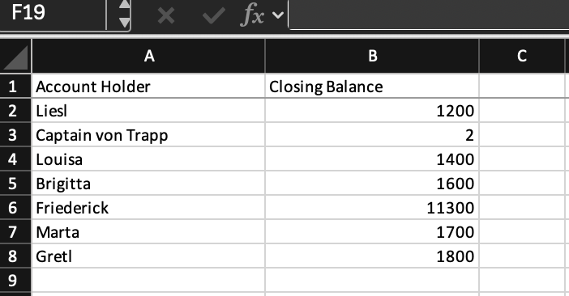

# Bank Statement Extraction Agent

An agentic pipeline that turns PDF bank statements into validated, structured Excel reports. Built for environments where statements arrive in inconsistent layouts and manual data entry does not scale.

## How it works

The agent is a 6 node LangGraph StateGraph. Each PDF flows through the nodes in sequence, with conditional routing that skips to the end on any error:

1. **Validate file** — confirms the input is a PDF, exists, falls within the allowed directory, and is under the size limit
2. **Detect format** — matches the PDF against known statement layouts in the format library
3. **Extract text** — pulls raw text from the PDF via pdfplumber
4. **Claude extraction** — sends the text to Claude with a structured prompt; returns JSON with account holder, transactions, and balances
5. **Validate output** — runs the JSON through Pydantic v2 models. On failure, fires a corrective prompt and retries once before flagging for human review
6. **Excel output** — writes validated data to a deduplicated Excel workbook, organized by statement month

Batch processing runs concurrently via ThreadPoolExecutor (default 5 workers), so multiple API calls are in flight simultaneously.

## Sample output



7 test statements processed, zero failures. Each row is one extracted account, grouped into a sheet tab by statement month.

## Security

Three hardening layers, each independently tested:

**Path traversal defense.** All file paths are resolved to their absolute form and checked against the allowed upload directory. A path containing `../` that would escape the directory is rejected.

**Prompt injection hardening.** System prompts instruct the model to treat document text as data only and ignore embedded instructions. Document content is never concatenated into the system prompt.

**Unicode sanitization.** Zero width spaces, bidirectional overrides, and other invisible characters are stripped before processing to prevent field corruption and display attacks.

## Multi tenant configuration

The `clients/` directory supports per client settings with a YAML config hierarchy:

```
clients/
  default/
    settings.yaml          # client metadata
    overrides/
      default.yaml         # field overrides merged on top of base format
formats_library/
  default.yaml             # canonical field definitions
```

New clients get their own directory. Overrides deep merge with the base format, so only differences need to be specified.

## Setup

```bash
git clone https://github.com/marinasofia/statement-agent.git
cd statement-agent
python3 -m venv venv
source venv/bin/activate
pip install -r requirements.txt
cp .env.example .env
# Add your Anthropic API key to .env
```

## Usage

Drop PDF statements into `uploads/`, then:

```bash
python3 run_batch.py
```

Output lands in `outputs/statements_batch.xlsx`.

## Tests

```bash
python3 -m pytest -v
```

6 tests covering file validation (non PDF rejection, missing file, path traversal), JSON cleanup (markdown fence stripping), text sanitization (invisible character removal), and schema validation (malformed date rejection).

## Limitations

This agent works on text based PDFs. Scanned or image only PDFs are not supported (no OCR). The format discovery module (`discover.py`) can propose a config for a new layout, but the output should be reviewed before production use.

## Tech stack

Python · LangGraph · Claude API (Anthropic) · Pydantic v2 · pdfplumber · openpyxl · tenacity · ThreadPoolExecutor