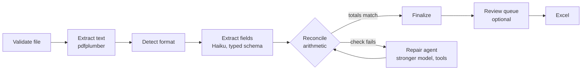

# Statement Agent

[](https://github.com/marinasofia/statement-agent/actions/workflows/ci.yml)
[](LICENSE)

A LangGraph agent that turns PDF bank statements into Excel, and only trusts the numbers once they add up to the cent.


## Why I built it

Typing bank statements into a spreadsheet is slow, and a model reading a PDF can misread one digit with full confidence. In financial data a wrong number does more harm than a missing one. So the model only extracts. Plain arithmetic decides whether the result is trusted, a repair agent fixes what does not add up by citing the line it read, and a person can approve each statement before it is exported.

## How it works


```mermaid
flowchart LR
    A[Validate file] --> B[Extract text<br/>pdfplumber]
    B --> C[Detect format]
    C --> D[Extract fields<br/>Haiku, typed schema]
    D --> E{Reconcile<br/>arithmetic}
    E -- totals match --> F[Finalize]
    E -- check fails --> G[Repair agent<br/>stronger model, tools]
    G --> E
    F --> H[Review queue<br/>optional]
    H --> I[Excel]
```

1. **Validate the file.** PDFs only, 20 MB at most, inside the upload folder. Scanned PDFs with no text layer are rejected before any model call.
2. **Extract text** with pdfplumber and detect the statement format.
3. **Extract fields** into a Pydantic schema with Claude Haiku. Output that fails validation gets one retry with the error, then one attempt on a stronger model.
4. **Reconcile.** Opening balance plus every transaction must equal the closing balance exactly. Dates must fall inside the statement period, and the account holder and number must appear in the text.
5. **Repair** when a check fails. A tool using agent searches the statement, reads lines and edits rows. Every amount it adds or changes must be printed on the line it cites. Then the same checks run again.
6. **Finalize** into one workbook per batch, or into a review queue where a person corrects and approves each statement before export.

## Quickstart, no API key

Python 3.12 or newer and [uv](https://docs.astral.sh/uv/).

```sh
git clone https://github.com/marinasofia/statement-agent.git
cd statement-agent
uv sync --locked --extra dev
uv run python -m pytest -q
uv run python -m evals.run_evals --mode replay
```

The tests and the eval both replay recorded model responses, so they run offline and cost nothing. CI runs the same two commands on every push.

## Use it on your own statements

```sh
cp .env.example .env          # add your ANTHROPIC_API_KEY
mkdir -p uploads && cp ~/Downloads/*.pdf uploads/
uv run python run_batch.py --output outputs/september.xlsx
```

| Flag | What it does |
|---|---|
| `--workers 5` | Statements extracted at once (5 is the default) |
| `--month 2026-09` | Sheet for statements with no readable date |
| `--review-db outputs/review.sqlite` | Hold every statement for human approval before export |
| `--fresh` | Extract every file again instead of reusing saved results |
| `--verbose` | Print holder and balance per file. Off by default so statement data stays out of logs |

To try the review workflow on a synthetic statement with no API calls:

```sh
uv run python demo_review.py
```

Then open `outputs/demo-review.html` and follow [the review walkthrough](docs/review-workflow.md).

## Evaluation

11 synthetic statements built by [`evals/make_fixtures.py`](evals/make_fixtures.py), each with a known correct answer. Every case checks the opening and closing balance, account number and holder, currency, statement date, transaction count and the sum of transactions.

| Result | Value |
|---|---|
| Cases passed | **11 / 11** |
| Reconciled on the first extraction | **10 / 10** text statements |
| Scanned image PDF | Rejected before any model call |
| Prompt injection inside a statement | Ignored, values unaffected |
| Byte identical duplicate | Detected and kept out of the workbook |
| Median cost per statement | **$0.0025** |
| Cost for all 11 | **$0.063** |
| Median latency | **1.7 s** |
| 260 transaction statement | Extracted in one call, $0.041, 36 s |

The cases cover US, Swiss, European and UK formats, comma decimals, dotted and month name dates, an overdraft, a statement with no transactions, and one with no opening balance, where the balance check is reported as skipped rather than passed. Costs and timings come from the original live run and are stored with the recordings in [`evals/results.json`](evals/results.json).

## Design decisions

**Arithmetic decides trust, not the model.** A model can sound sure about a wrong number. Balances either reconcile to the cent or they do not, so [`reconcile.py`](agents/statement_extraction/reconcile.py) is plain code with no model call, and its verdict is the one that counts.

**The repair agent has to show its source.** Its tools reject any edit whose amount, date and a word of the description are not printed on the cited line. It removes a row only when the amount is printed nowhere, is a duplicate, or is a balance line. It can change balances and dates but never the account holder or number. It gets at most 8 model calls and $0.10 per statement.

**Cheap model first, stronger model only when needed.** Haiku handles extraction. The stronger model runs only when validation or reconciliation fails, which in the eval never happened.

**Excel export is safe to open.** Every string is written as a text cell, so a transaction description like `=HYPERLINK(...)` shows as text instead of running as a formula.

**Runs resume instead of repeating paid calls.** Each result is saved the moment it finishes, keyed by the SHA-256 of the file's bytes. A crash loses only the files in flight, a renamed copy is recognized, and an edited file is extracted again. Saved results drop the raw statement text, and the database is readable by its owner only.

## Project layout

```text
agents/statement_extraction/   graph, nodes, schema, reconcile, repair agent
core/                          LLM client, recordings, Excel, review queue, result store
evals/                         fixture builder, eval runner, recordings, results
tests/                         142 tests
run_batch.py                   batch CLI
review.py                      review queue CLI
docs/                          review workflow, output contracts, technical reference
```

## Tests

142 tests run in about a second with no API key, 22 of them for the repair agent and its tools. They cover reconciliation, schema retries, escalation, batch failures, the result store, the review queue and the Excel output contract. A full repair run is tested with scripted model turns on a statement whose fee is printed outside the transaction table.

## More

[Technical reference](docs/technical-reference.md) · [Output contracts](docs/output-contracts.md) · [Contributing](CONTRIBUTING.md) · [Security](SECURITY.md)

Python · LangGraph · Anthropic SDK · Pydantic · pdfplumber · openpyxl · SQLite

MIT licensed. All fixtures are synthetic: every name, bank and account number is invented.
